# 钩子

在v3.2.2版本中已经将指令拦截器删除, 这是一个拦截器的替代品但作用范围更广，可以拓展到任何有“流程”的对象中。

ROB版本在v3.2.2(不包含) 以上即可使用

## 已实现的Hook点

1. 指令管理器

## 使用前须知

> 钩子的部分`全部`由框架内部实现, 用户只需要传入控制流程的lambda.

## 使用

以指令管理器为例

```kotlin
OneBotFactory.commandManager.attach(OneBotFactory.commandManager.hookExecuteGroup) { // scope: this: CommandManagerImpl it: CommandHooking<GroupMessage> 
    println(it.message)
    // it.command: BaseCommand
    println(it.command is TestCommand)
    println("hooking")
    return@attach Hookable.Result.Terminated
}
```

> `attach`传入的是预定义的HookPoint, 除`hookExecuteGroup`之外还有`hookExecutePrivate`

## 流程图

